<p align="center">
  
</p>

<h1 align="center">PuriPuly <3</h1>

<p align="center">
  
  
  
  
</p>

<p align="center">LLM-based two-way translator for VRChat</p>

<h2 align="center">
  <a href="README.md">🇺🇸 English</a> ·
  🇰🇷 한국어 ·
  <a href="README.ja.md">🇯🇵 日本語</a> ·
  <a href="README.zh-CN.md">🇨🇳 简体中文</a>
</h2>

---

## Demo

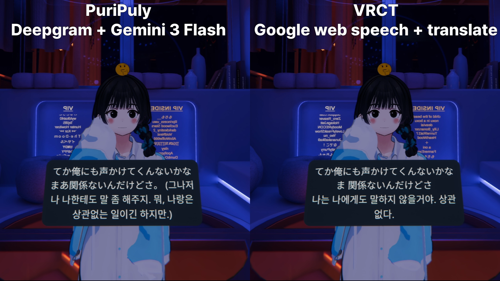

---

<video src="https://github.com/user-attachments/assets/c667f44d-b91d-42a9-b24a-e6a993b392d3" controls width="100%"></video>

데모 영상 유튜브 링크:
- [데모 1](https://www.youtube.com/watch?v=3p0CamYui0o)
- [데모 2](https://youtu.be/DoX36Y7J_lc?si=YjbeVTS8v3jGQB1w)

---

## Finally, talk like real friends.

위로하고 싶었는데  
"괜찮아?"밖에 못 건넨 적 있잖아요.

전하고 싶은 마음이  
'번역기'로는 안 되는 거 알잖아요.

그래서 만들었어요.

- **LLM 기반 현지화** — 슬랭, 구어체, 반말/존댓말까지 자연스럽게
- **맥락 기억** — 문맥을 고려한 자연스러운 대화 흐름 유지
- **양방향 음성 번역** — 상대 음성도 같이 번역, VR 자막 오버레이 지원
- **디스코드로 시작** — 복잡한 설정 과정 없이 바로 사용 가능

## Q&A

- **번역 품질은 어느정도인가요?**
→ 상대방과 나 둘 다 이 번역기를 사용했을 시 가장 깊은 대화까지 할 수 있을 정도에요. 정량적인 면에서 말씀드리자면 Gemma 4 기준으로 DeepL보다 6배 더 나았어요. 자세한 내용은 아래의 '번역 비교' 항목을 봐주세요.

- **말하고 번역이 되기까지 시간이 얼마나 걸리나요?**
→ Gemma 4와 클라우드 STT 서비스를 사용한 기준에서 지연 시간은 보통 1초 중후반대에요.

- **사용하는데 돈이 드나요?**
→ 네, 하지만 나중에요. 신규 사용자에게는 무료 사용량이 주어져요. 그 이후에도 가격은 매우 저렴해요. 1달러에 수천번 사용할 수 있어요.

- **API 키를 발급 받아야 하나요?**
→ 네, 하지만 이것도 나중에요. 처음에는 그냥 설치하고 디스코드로 인증만하면 쓸 수 있어요.

- **상대방의 음성을 번역하는 기능은 어느정도 수준의 완성도인가요?**
→ 노이즈가 적은 환경에서 둘이 있을 때는 좋은 경험을 줄 수 있어요. 세명까지도 괜찮지만 그 위로는 사용성을 보장할 수 없어요. VRChat에서 사용할 경우 Earmuff 기능을 사용해서 환경을 통제해주세요.

- **음성 인식이 잘 안 돼요 / 느려요**
→ 로컬 Qwen ASR을 사용하는 상황이면 클라우드 STT 서비스로 바꾸는 걸 추천해요. 만약에 인텔 사용자라면 PuriPuly를 Pcore만 고정 할당되게 설정해주세요.

- **음성과 대화 내용은 어떻게 처리되나요?**
→ 오로지 자신의 전사문과 번역 결과만을 로컬에 저장해요. 또한 타인의 음성, 전사문, 번역 결과는 기록하지 않아요. 다만 STT 서비스와 번역 제공자가 데이터를 처리할 수 있어요.

### [📥 다운로드](https://github.com/kapitalismho/PuriPuly-heart/releases/latest)

---

## 비교


- 마이크로소프트의 Gemba MQM 프레임워크를 사용해서 실험했어요.
- 실제 대화 환경과 가깝게 하기 위해 멀티턴 환경으로 구성했어요.
- 전체 실험 결과는 [여기](https://github.com/kapitalismho/korean-llm-context-translation-benchmark)를 참조해주세요.

## 비용

### 1달러 당 사용 가능 횟수

| LLM \ ASR | Qwen ASR (Local) | Qwen ASR (Cloud) | Soniox | Deepgram |
|---|---|---|---|---|
| **Gemma 4 26B A4B** | 14,380회 | 2,920회 | 3,710회 | 1,180회 |
| **DeepSeek V4 Flash** | 19,410회 | 3,080회 | 3,980회 | 1,210회 |
| **DeepSeek V4 Pro** | 6,400회 | 2,330회 | 2,810회 | 1,070회 |
| **Gemini 3 Flash** | 1,710회 | 1,170회 | 1,280회 | 740회 |
| **Gemini 3.1 Flash-Lite** | 3,430회 | 1,770회 | 2,030회 | 940회 |
| **Qwen 3.5 Plus** | 7,460회 | 2,460회 | — | — |
| **Local LLMs** | 무제한 | 3,660회 | 5,000회 | 1,290회 |

### 발화당 비용

| LLM \ ASR | Qwen ASR (Local) | Qwen ASR (Cloud) | Soniox | Deepgram |
|---|---|---|---|---|
| **Gemma 4 26B A4B** | ~0.1원 | ~0.5원 | ~0.4원 | ~1.3원 |
| **DeepSeek V4 Flash** | ~0.08원 | ~0.5원 | ~0.4원 | ~1.2원 |
| **DeepSeek V4 Pro** | ~0.2원 | ~0.6원 | ~0.5원 | ~1.4원 |
| **Gemini 3 Flash** | ~0.9원 | ~1.3원 | ~1.2원 | ~2.0원 |
| **Gemini 3.1 Flash-Lite** | ~0.4원 | ~0.8원 | ~0.7원 | ~1.6원 |
| **Qwen 3.5 Plus** | ~0.2원 | ~0.6원 | — | — |
| **Local LLMs** | 0원 | ~0.4원 | ~0.3원 | ~1.2원 |

*   *(입력 900 토큰 + 출력 12토큰) x 발화 1회당 평균 LLM 호출 횟수 1.2회 가정*
*   *1달러 당 사용 가능 횟수는 발화당 비용 테이블의 반올림 전 계산값 기준*
*   *모든 비용과 사용 가능 횟수는 근사치 계산*
*   *DeepSeek의 경우 캐시 히트율 70% 가정*
*   *Qwen API 비용은 베이징 리전 기준*
*   *요금표 기준: 2026년 5월 25일 / 빠른 응답 모드 활성화*
*   *1 달러 = 1500원*

### 무료 크레딧

| 서비스 | 무료 크레딧 | 기한 | 비고 |
|--------|------------|------|------|
| **Deepgram** | $200 | 없음 | - |
| **Google AI Studio** | $10 | 1년 | Gemini 구독자에게 매월 지급 |
| **Alibaba Cloud** | 모델당 100만 토큰 | 90일 | 싱가포르 리전 기준|
| **Alibaba Cloud** | ¥300 | 1년 | 중국 내 학생 대상 |

---

# 문제가 생기거나 애매모한 게 있다면 편하게 [트위터](https://x.com/kapitalismho)에서 DM을 보내주세요.

## 사용법

1. [다운로드 페이지](https://github.com/kapitalismho/PuriPuly-heart/releases/latest)에서 최신 버전 다운로드
2. PuriPuly 설치
3. **STT** 버튼 클릭
4. **TRANS** 버튼 클릭 후 디스코드 인증 

   > 번역 모델이 Gemma 4 혹은 Deepseek이면서 연결 방식이 관리형이어야 디스코드 인증이 가능해요.

5. **Subtitles** 버튼을 눌러 VR 자막 켜기 
6. (선택) **Peer** 버튼을 눌러 상대 음성 번역 켜기

   > 상대 음성 번역 기능이 제대로 작동하기 위해서는 시끄럽지 않은 공간이 필요해요. VRChat에서 사용할 경우 Earmuff 기능을 사용해서 환경을 통제해주세요.

7. VRChat에서 OSC 활성화: Action menu → Settings → OSC → Enable

### 오디오 캡쳐가 되지 않는다면
오디오 캡쳐가 되지 않는다면 **설정 > 일반**에서 다음 절차를 따라주세요.

1. **오디오 호스트 API**를 **자동선택** 혹은 **MME**로 변경
2. 알맞은 마이크 선택
3. 앱 재시작

그래도 해결되지 않는다면 트위터 DM 혹은 [issue #10](https://github.com/kapitalismho/PuriPuly-heart/issues/10)에 보고해주세요.

---

### 중국 사용자를 위한 안내

Soniox/Gemini/Deepgram이 차단된 지역이라면 아래와 같은 조합으로 사용해주세요.

- STT: **Qwen ASR**
- LLM: **DeepSeek V4 Flash** 혹은 **DeepSeek V4 Pro**

   > 관리형 연결방식을 사용시 '관리형' 옵션 대신 '관리형 (중국)'을 사용해주세요.

---

### 자신의 API 키 사용하기 

사용하려는 서비스에 따라 알맞은 가이드를 보고 따라해주세요.

번역용 LLM은 Openrouter를 통해서 Gemma 4 모델을 사용하는 것을 추천해요.

혹시 이왕 설정하는 김에 ASR 쪽도 같이 설정하면 어떨까요?
PuriPuly는 클라우드 STT와 결합했을 때 최상의 경험을 제공해요.
예를 들어 같은 Qwen ASR이라도 로컬과 클라우드의 음성 인식 성능은 상당히 차이나요.

우선 Deepgram으로 시작하는걸 추천해요.
가입만 하면 무료 크레딧 200달러 어치를 받을 수 있어요.

<details>
<summary><h3>OpenRouter</h3></summary>

1. 빨간색 원 안의 옵션을 화면과 같이 설정해주세요.
   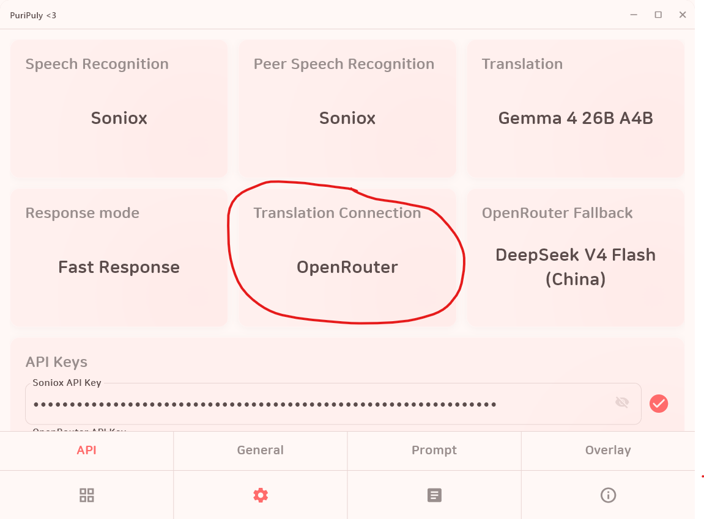

2. 앱에서 빨간색 원 안의 버튼을 눌러주세요
   

3. Openrouter에서 로그인하세요
   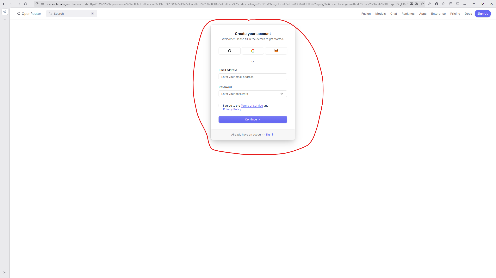

4. 빨간색 원 안의 버튼을 눌러 결제창을 빠져나가세요
   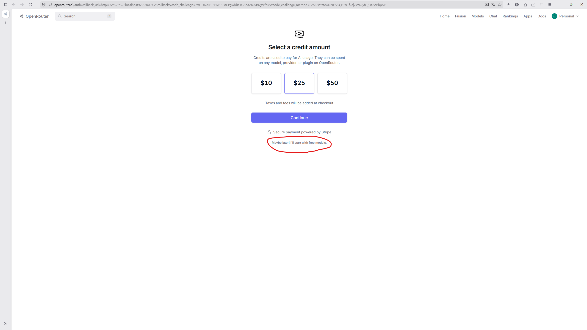

5. **Authorize** 버튼을 누르세요
   

6. 사용할 만큼 선불금을 충전하세요
   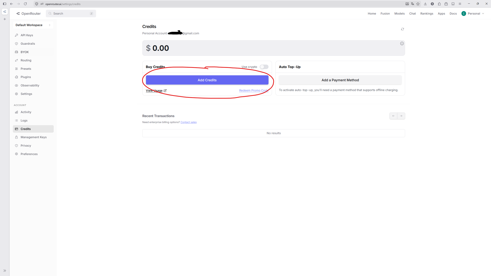

<details>
<summary><h3>Authorize 버튼을 눌렀는데도 인증이 되지 않았다면</h3></summary>

Authorize 버튼을 눌렀는데도 인증이 안되어 있다면 재시도 하거나 아래와 같이 직접 API 키를 발급해서 붙여넣기 해주세요.

6. 오른쪽 상단의 계정을 클릭 한 후 왼쪽의 API Keys 탭에 들어간 후 중앙의 Create 버튼을 누르세요
   

7. Create 버튼을 누르세요
   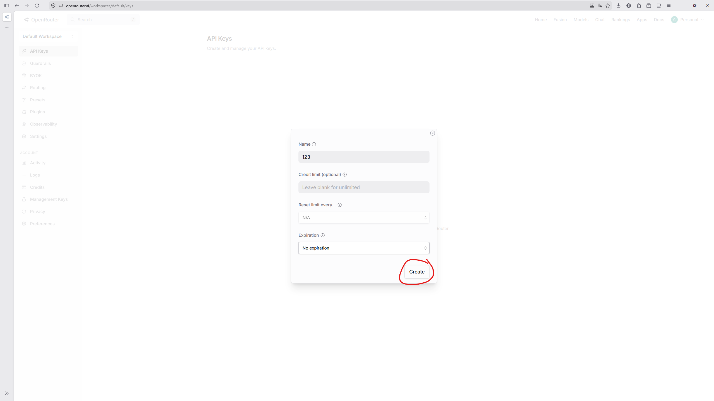

8. 버튼을 눌러 API 키를 복사 한후 번역기의 API 탭에 붙여넣으세요
   

</details>

</details>

<details>
<summary><h3>DeepSeek</h3></summary>

1. 빨간색 원 안의 옵션을 화면과 같이 설정해주세요.
   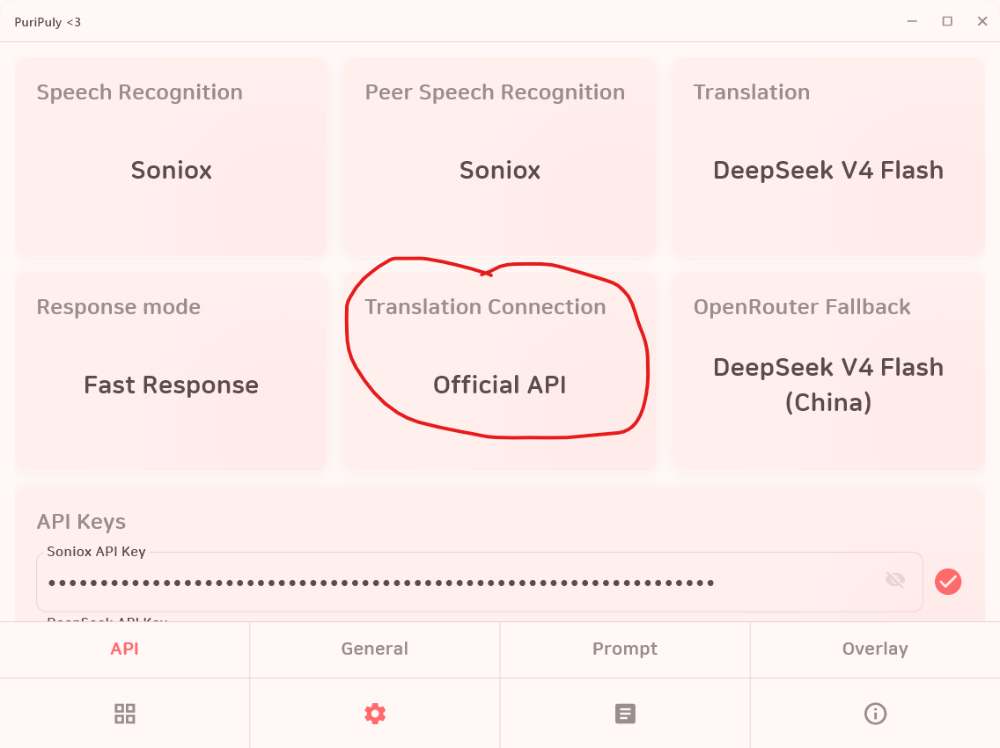

2. [deepseek 공식 홈페이지](https://www.deepseek.com/en/)에 접속해서 **Access API** 버튼을 클릭하세요.
   

3. 홈페이지에서 로그인하세요
   

4. API Keys 탭으로 이동한 후 **Create new API Keys**를 누르세요.
   

5. 버튼을 눌러 API 키를 복사 한후 번역기의 API 탭에 붙여넣으세요
   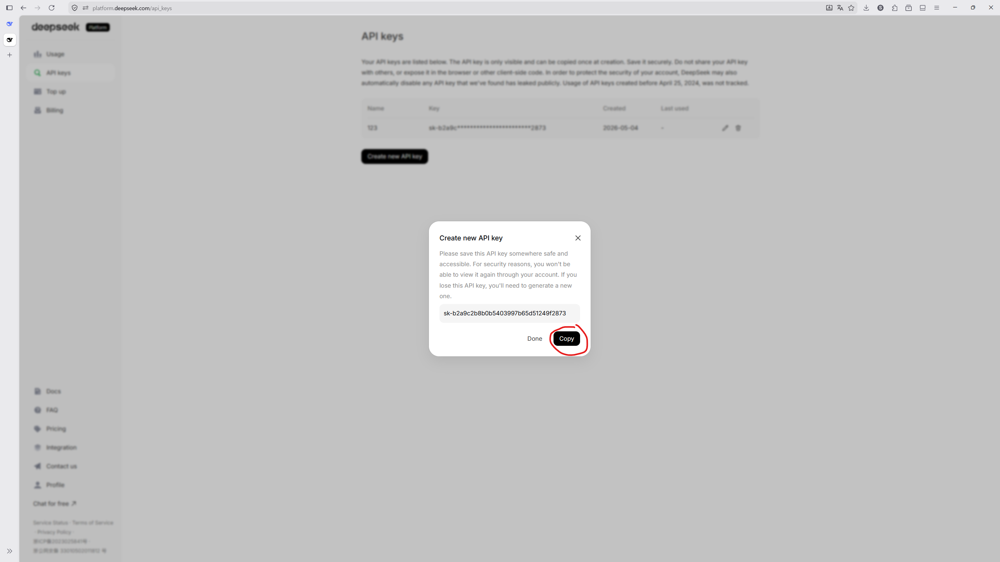

6. Top Up 탭으로 이동한 후 사용할 만큼 선불금을 충전하세요
   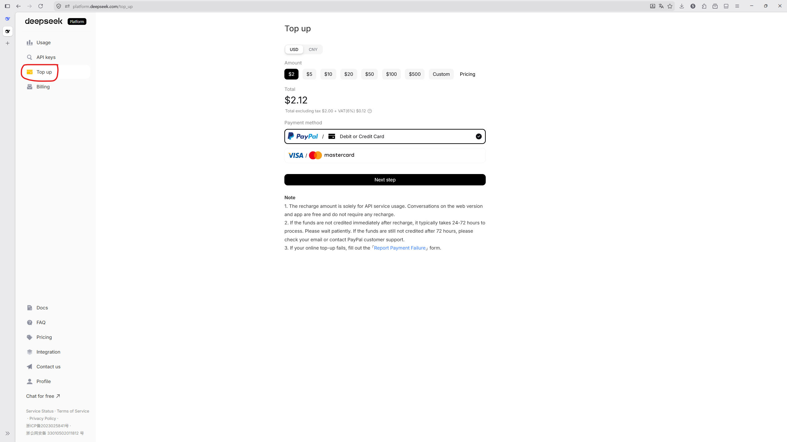

</details>

<details>
<summary><h3>Deepgram</h3></summary>

1. [Deepgram Console](https://console.deepgram.com/)에 접속하여 로그인하세요.
   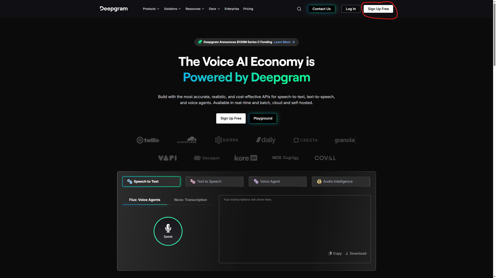

2. 가입 환영 메시지 및 설문이 나오면 **Skip**을 눌러 건너뛰세요.
   

3. 서비스 선택 화면에서 **STT (Speech-to-Text)**를 선택하세요.
   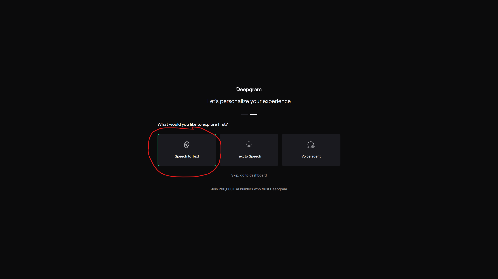

4. API Keys 메뉴에서 **Create a New API Key**를 클릭하세요.
   

5. 키 이름을 입력하고(예: `puripuly`) 생성하세요.
   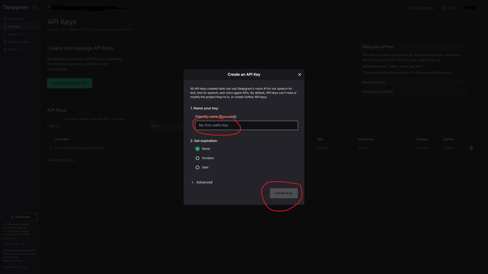

6. 생성된 키를 복사하여 PuriPuly 설정에 붙여넣으세요.
   

</details>

<details>
<summary><h3>Gemini</h3></summary>

1. [Google AI Studio](https://aistudio.google.com/apikey)에 접속해서 **Get API key** 버튼을 클릭하세요.
   

2. 새로운 프로젝트를 만드세요.
   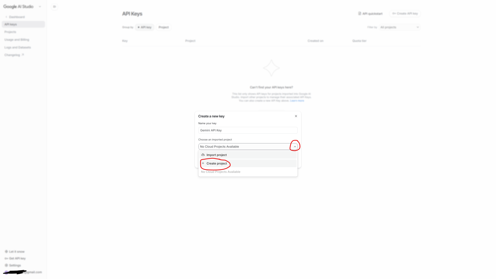

3. 임의의 이름을 지어주세요.
   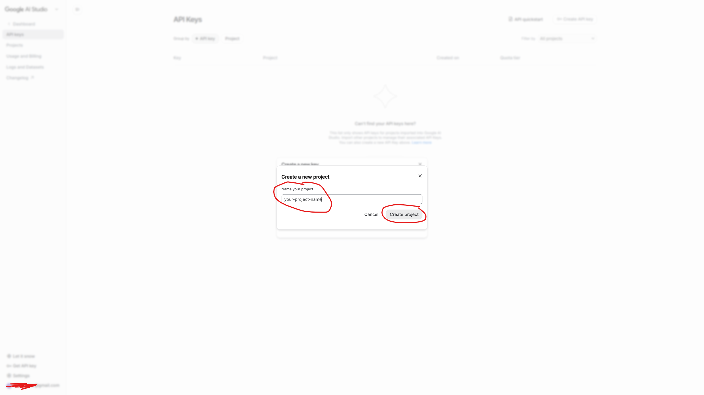

4. 만든 프로젝트를 선택하고 **Create key**를 눌러주세요
   

5. 동그라미 친 곳을 눌러주세요.
   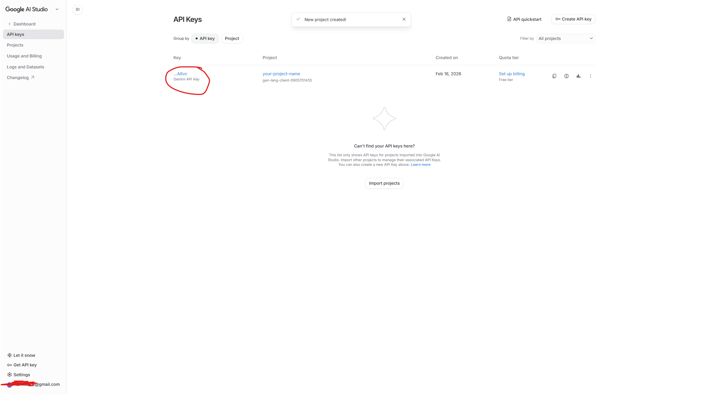

6. 동그라미 친 곳을 눌러 key를 복사하세요.
   

7. (권장) 노란색으로 강조된 **Set Up Billing** 버튼을 눌러 유료 티어로 전환하세요.
티어 전환에는 약간의 시간이 필요할 수 있어요.
   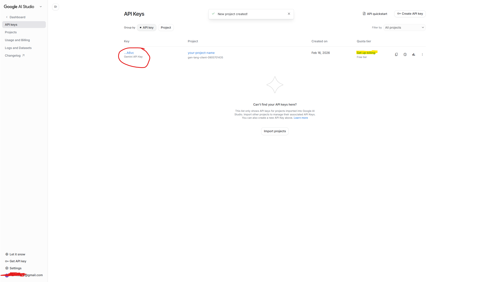

<details>
<summary><h3>제미나이 유료 구독자라면</h3></summary>

8. [Google Developer Program](https://developers.google.com/program/my-benefits) 에 들어가 프로그램에 참여하세요
   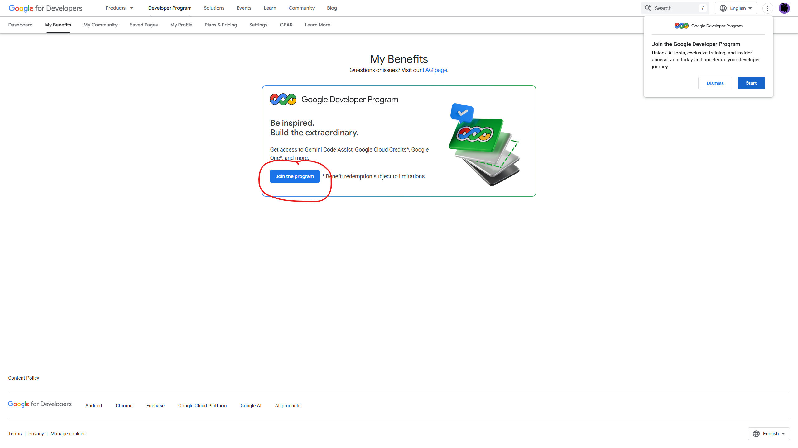

9. 7 단계에서 설정한 유료 티어 프로젝트를 선택하세요
   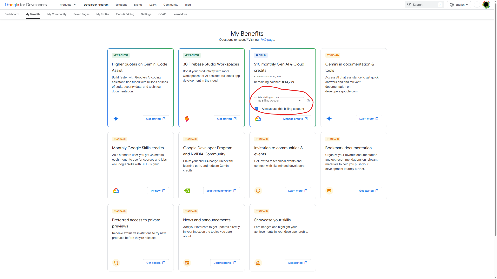

</details>

</details>

<details>
<summary><h3>Qwen</h3></summary>

1. 지역에 따라 알맞는 경로로 Alibaba Cloud Model Studio에 접속하세요.
   - [중국 본토](https://bailian.console.aliyun.com/cn-beijing)
   - [중국 본토 외 다른 지역](https://bailian.console.alibabacloud.com)

2 [Alibaba Cloud Model Studio](https://bailian.console.alibabacloud.com)접속한 주소에서 로그인 하세요. 본인이 API 키를 발급받으려는 리전(Region)을 정확히 선택해주세요. (예: Beijing)
   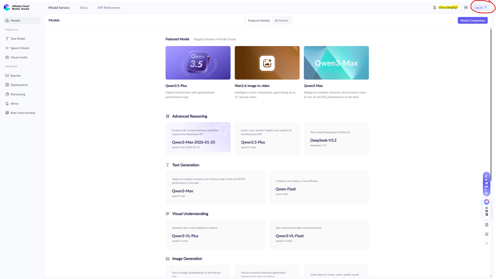

3 우측 상단의 **톱니바퀴 아이콘**을 클릭하세요.
   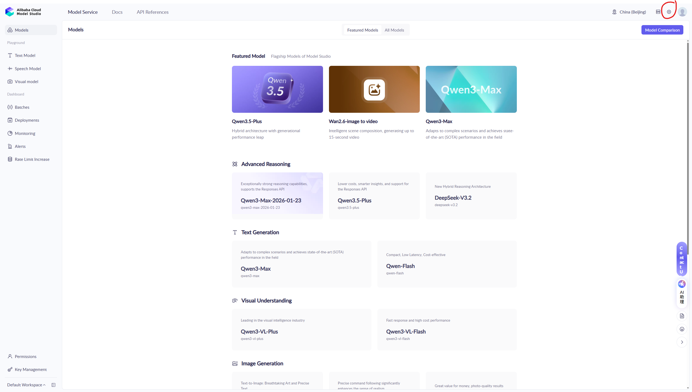

4 워크스페이스를 생성하고 **API-KEY** 페이지로 넘어가세요.
   

5 **Create API Key**를 클릭하세요.
   

6 어카운트와 워크스페이스를 할당하고 OK 버튼을 눌러주세요
   

7 동그라미 친 곳을 눌러 key를 복사하세요.
   

</details>

<details>
<summary><h3>Soniox</h3></summary>

1. [Soniox Console](https://console.soniox.com/)에 로그인하세요.
   

2. 조직 이름을 임의로 적어주세요.
   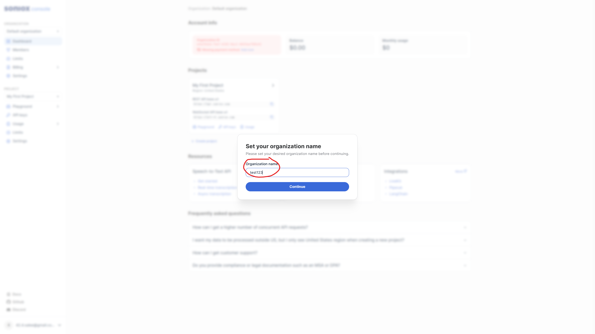

3. **Add Funds** 버튼을 눌러 결제 수단을 연결하세요.
   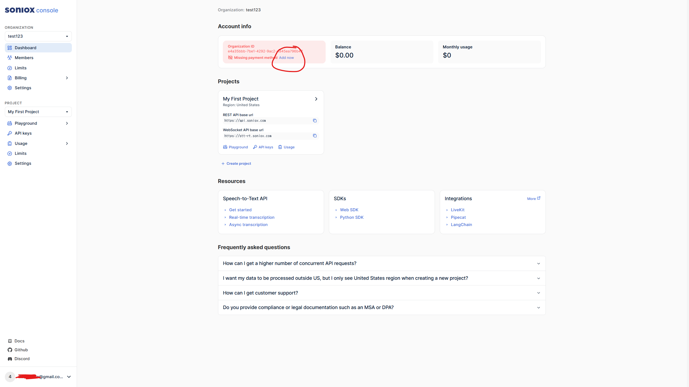

4. 소니옥스는 선불금 충전이 필요해요. 충전 후에 **API Keys** 메뉴로 이동하세요.
   

5. 새로운 API Key를 생성하세요.
   

6. 생성된 키를 복사하여 PuriPuly 설정에 붙여넣으세요.
   

</details>

---

## 개발

### 개발 환경 요약

| 영역 | 권장 환경 |
|---|---|
| Python 앱 | Windows |
| VR 오버레이 | Windows |
| Broker 서비스 | Linux / WSL |

### Python 앱

```bash
python -m venv .venv
.venv\Scripts\activate  # Windows
```

```bash
# pip
pip install -e '.[dev]'

# 또는 uv
uv sync --dev
```

```bash
pre-commit install
```

### GUI 실행

```bash
# 가상환경 활성화 후
python -m puripuly_heart.main run-gui

# 또는 uv를 통해 실행
uv run python -m puripuly_heart.main run-gui
```

```bash
# 숨겨진 UI 확인 가능
python -m puripuly_heart.main run-gui --debug-ui-preview
```

### 테스트와 린트

```bash
black src tests          # 포맷
ruff check src tests     # 린트
python -m pytest         # 테스트 (가상환경에서 실행 권장)
```

### VR 오버레이

VR 자막 오버레이는 `native/overlay/`의 Rust 프로젝트에서 빌드해요.

```powershell
cargo test --manifest-path native/overlay/Cargo.toml -q

cargo build `
  --manifest-path native/overlay/Cargo.toml `
  --locked `
  --release `
  --bin PuriPulyHeartOverlay `
  --target-dir target

New-Item -ItemType Directory -Force -Path build/overlay | Out-Null
Copy-Item target/release/PuriPulyHeartOverlay.exe build/overlay/PuriPulyHeartOverlay.exe -Force
Copy-Item third_party/openvr/win64/openvr_api.dll build/overlay/openvr_api.dll -Force

.\build\overlay\PuriPulyHeartOverlay.exe --check-startup-contract
```

### Broker 서비스

자세한 내용은 `broker/README.md`를 참고하세요.

```bash
pnpm install --frozen-lockfile
pnpm run typecheck
pnpm exec vitest run
pnpm --filter @puripuly-heart/broker run verify:config
pnpm --filter @puripuly-heart/broker run dev
```

---

## 개발자

[salee](https://github.com/kapitalismho)

---

## 기여자

[RICHARDwuxiaofei](https://github.com/RICHARDwuxiaofei)

---

## Special Thanks

SUI\_32C, Nagikokoro, motoka96, \_Ykol魚, kascr\_, Just Monika V, FLUVIA, Han โชเล่ย์, EA\_PE, Ephedrine

---

## 라이선스

[AGPL-3.0-or-later](LICENSE)

타사 라이선스 및 고지: `src/puripuly_heart/data/THIRD_PARTY_NOTICES.txt`
