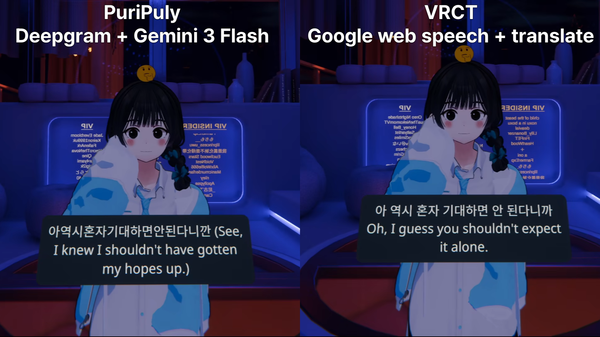

<p align="center">
  
</p>

<h1 align="center">PuriPuly <3</h1>

<p align="center">
  
  
  
  
</p>

<p align="center">LLM-based two-way translator for VRChat</p>

<h2 align="center">
  🇺🇸 English ·
  <a href="README.ko.md">🇰🇷 한국어</a> ·
  <a href="README.ja.md">🇯🇵 日本語</a> ·
  <a href="README.zh-CN.md">🇨🇳 简体中文</a>
</h2>

---

## Demo



---

<video src="https://github.com/user-attachments/assets/c667f44d-b91d-42a9-b24a-e6a993b392d3" controls width="100%"></video>

Demo video YouTube links:
- [Demo 1](https://www.youtube.com/watch?v=3p0CamYui0o)
- [Demo 2](https://youtu.be/DoX36Y7J_lc?si=YjbeVTS8v3jGQB1w)

---

## Finally, talk like real friends.

You've been there.  
Wanting to comfort a friend,  
but only managing: "Are you okay?"

You already know a 'translator'  
can't carry what's truly in your heart.

So I built one that can.

- **LLM-Powered Localization** — Slang, colloquialisms, and casual/formal speech, all rendered naturally.
- **Context Memory** — Keeps the conversation flowing naturally with awareness of prior context.
- **Two-way Voice Translation** — Translates the other person's voice too, with VR subtitle overlay support.
- **Start via Discord** — Get going right away without a complex setup process.

## Q&A

- **How good is the translation quality?**
→ When both you and the other person use this translator, you can have even the deepest kinds of conversations. Quantitatively, with Gemma 4 it scored 6× better than DeepL. See the 'Translation Comparison' section below for details.

- **How long does it take from speaking to getting a translation?**
→ With Gemma 4 and a cloud STT service, latency is typically in the mid-to-late 1-second range.

- **Does it cost money to use?**
→ Yes, but only later. New users get a free usage allowance, and even after that the pricing is very cheap; you can use it thousands of times for $1.

- **Do I need to get an API key?**
→ Yes, but again, only later. At first, just install and authenticate via Discord to start using it.

- **How polished is the feature for translating the other person's voice?**
→ It works best for one-on-one conversations in low-noise environments. Up to three people may be okay, but usability is not guaranteed. When using it in VRChat, use Earmuff to control the environment.

- **Voice recognition is poor / slow.**
→ If you're using local Qwen ASR, we recommend switching to a cloud STT service. If you're on Intel, configure PuriPuly so it's pinned to P-cores only.

- **How are voice and conversation contents handled?**
→ Only your own transcripts and translation results are stored locally. Other people's voices, transcripts, and translation results are never recorded. That said, the STT service and translation provider may process the data.

### [📥 Download](https://github.com/kapitalismho/PuriPuly-heart/releases/latest)

---

## Translation Comparison


- We ran the experiment using Microsoft's Gemba MQM framework.
- It was set up as a multi-turn environment to better resemble real conversation.
- For the full results, see [here](https://github.com/kapitalismho/korean-llm-context-translation-benchmark).

## Cost

### Uses per Dollar

| LLM \ ASR | Qwen ASR (Local) | Qwen ASR (Cloud) | Soniox | Deepgram |
|---|---|---|---|---|
| **Gemma 4 26B A4B** | 14,380 | 2,920 | 3,710 | 1,180 |
| **DeepSeek V4 Flash** | 19,410 | 3,080 | 3,980 | 1,210 |
| **DeepSeek V4 Pro** | 6,400 | 2,330 | 2,810 | 1,070 |
| **Gemini 3 Flash** | 1,710 | 1,170 | 1,280 | 740 |
| **Gemini 3.1 Flash-Lite** | 3,430 | 1,770 | 2,030 | 940 |
| **Qwen 3.5 Plus** | 7,460 | 2,460 | — | — |
| **Local LLMs** | Unlimited | 3,660 | 5,000 | 1,290 |

### Cost per Utterance

| LLM \ ASR | Qwen ASR (Local) | Qwen ASR (Cloud) | Soniox | Deepgram |
|---|---|---|---|---|
| **Gemma 4 26B A4B** | ~$0.00007 | ~$0.0003 | ~$0.0003 | ~$0.0008 |
| **DeepSeek V4 Flash** | ~$0.00005 | ~$0.0003 | ~$0.0003 | ~$0.0008 |
| **DeepSeek V4 Pro** | ~$0.0002 | ~$0.0004 | ~$0.0004 | ~$0.0009 |
| **Gemini 3 Flash** | ~$0.0006 | ~$0.0009 | ~$0.0008 | ~$0.0014 |
| **Gemini 3.1 Flash-Lite** | ~$0.0003 | ~$0.0006 | ~$0.0005 | ~$0.0011 |
| **Qwen 3.5 Plus** | ~$0.0001 | ~$0.0004 | — | — |
| **Local LLMs** | $0 | ~$0.0003 | ~$0.0002 | ~$0.0008 |

*   *Based on (Input 900 tokens + Output 12 tokens) × 1.2 avg LLM calls per utterance.*
*   *Uses per Dollar is derived from the un-rounded values in the Cost per Utterance table.*
*   *All costs and usage counts are approximate.*
*   *DeepSeek assumes a 70% cache hit rate.*
*   *Qwen API costs are based on the Beijing region.*
*   *Pricing as of May 25, 2026 / Fast Response mode active.*

### Free Credits

| Service | Free Credit | Duration | Note |
|--------|------------|------|------|
| **Deepgram** | $200 | None | - |
| **Google AI Studio** | $10 | 1 year | Monthly for Gemini subscribers |
| **Alibaba Cloud** | 1M tokens per model | 90 days | Singapore region |
| **Alibaba Cloud** | ¥300 | 1 year | Students in China |

---

# If you run into problems or anything feels unclear, feel free to DM me on [Twitter/X](https://x.com/kapitalismho).

## Usage

1. Download the latest version from the [Download page](https://github.com/kapitalismho/PuriPuly-heart/releases/latest).
2. Install PuriPuly.
3. Click the **STT** button.
4. Click the **TRANS** button, then authenticate via Discord.

   > Discord authentication is only available when the translation model is Gemma 4 or DeepSeek and the connection mode is Managed.

5. Click the **Subtitles** button to turn on VR subtitles.
6. (Optional) Click the **Peer** button to enable translation of the other person's voice.

   > Peer voice translation needs a low-noise space to work properly. When using it in VRChat, use Earmuff to control the environment.

7. Enable OSC in VRChat: Action menu → Settings → OSC → Enable.

### If audio capture does not work
If audio capture does not work, open **Settings > General** and follow these steps.

1. Change **Audio Host API** to **Auto** or **MME**.
2. Select the correct microphone.
3. Restart the app.

If it still does not work, report it by Twitter DM or in [issue #10](https://github.com/kapitalismho/PuriPuly-heart/issues/10).

---

### Note for Users in China

If Soniox/Gemini/Deepgram are blocked in your region, please use the following combination:

- STT: **Qwen ASR**
- LLM: **DeepSeek V4 Flash** or **DeepSeek V4 Pro**

   > When using the managed connection mode, choose **Managed (China)** instead of **Managed**.

---

### Using Your Own API Keys

Follow the guide that matches the service you want to use.

For the translation LLM, we recommend using the Gemma 4 model through OpenRouter.

By the way, while you're setting things up, why not configure ASR too?
PuriPuly delivers the best experience when paired with a cloud STT.
For instance, even with the same Qwen ASR, local and cloud voice-recognition performance differ noticeably.

We recommend starting with Deepgram.
Just signing up gets you $200 in free credits.

<details>
<summary><h3>OpenRouter</h3></summary>

1. Set the options inside the red circle as shown in the screenshot.
   

2. In the app, click the button inside the red circle.
   

3. Login at OpenRouter.
   

4. Click the button inside the red circle to exit the payment screen.
   

5. Click the **Authorize** button.
   

6. Prepay as much as you plan to use.
   

<details>
<summary><h3>If clicking Authorize didn't authenticate you</h3></summary>

If you clicked Authorize but you're still not authenticated, retry, or directly issue an API key as below and paste it in.

6. Click your account in the top right, go to the API Keys tab on the left, then click the Create button in the center.
   

7. Click the Create button.
   

8. Click the button to copy the API key, then paste it into the API tab of the translator.
   

</details>

</details>

<details>
<summary><h3>DeepSeek</h3></summary>

1. Set the options inside the red circle as shown in the screenshot.
   

2. Go to the [DeepSeek official homepage](https://www.deepseek.com/en/) and click the **Access API** button.
   

3. Login on the homepage.
   

4. Go to the API Keys tab and click **Create new API Keys**.
   

5. Click the button to copy the API key, then paste it into the API tab of the translator.
   

6. Go to the Top Up tab and prepay as much as you plan to use.
   

</details>

<details>
<summary><h3>Deepgram</h3></summary>

1. Login to the [Deepgram Console](https://console.deepgram.com/).
   

2. If you see a welcome message/survey, click **Skip**.
   

3. Select **STT (Speech-to-Text)** on the service selection screen.
   

4. In the API Keys menu, click **Create a New API Key**.
   

5. Enter a key name (e.g., `puripuly`) and create.
   

6. Copy the generated key and paste it into PuriPuly settings.
   

</details>

<details>
<summary><h3>Gemini</h3></summary>

1. Go to [Google AI Studio](https://aistudio.google.com/apikey) and click the **Get API key** button.
   

2. Create a new project.
   

3. Choose any name for the project.
   

4. Select the project you created and click **Create key**.
   

5. Click the circled area.
   

6. Click the circled area to copy the key.
   

7. (Recommended) Click the yellow **Set Up Billing** button to upgrade to the paid tier.
The tier transition may take a moment.
   

<details>
<summary><h3>For Gemini paid subscribers</h3></summary>

8. Go to [Google Developer Program](https://developers.google.com/program/my-benefits) and join the program.
   

9. Select the paid tier project you set up in step 7.
   

</details>

</details>

<details>
<summary><h3>Qwen</h3></summary>

1. Access Alibaba Cloud Model Studio via the appropriate path for your region:
   - [Mainland China](https://bailian.console.aliyun.com/cn-beijing)
   - [Outside Mainland China](https://bailian.console.alibabacloud.com)

2. Login at the URL above. Make sure to select the correct Region for your API key (e.g., Beijing).
   

3. Click the **gear icon** in the top right.
   

4. Create a workspace and go to the **API-KEY** page.
   

5. Click **Create API Key**.
   

6. Assign an account and workspace, then click OK.
   

7. Click the circled area to copy the key.
   

</details>

<details>
<summary><h3>Soniox</h3></summary>

1. Login to [Soniox Console](https://console.soniox.com/).
   

2. Enter an organization name of your choice.
   

3. Click **Add Funds** to link a payment method.
   

4. Soniox requires prepaid credits. Once added, go to the **API Keys** menu.
   

5. Create a new API Key.
   

6. Copy the generated key and paste it into PuriPuly settings.
   

</details>

---

## Development

### Environment Summary

| Area | Recommended Environment |
|---|---|
| Python app | Windows |
| VR overlay | Windows |
| Broker service | Linux / WSL |

### Python App

```bash
python -m venv .venv
.venv\Scripts\activate  # Windows
```

```bash
# pip
pip install -e '.[dev]'

# or uv
uv sync --dev
```

```bash
pre-commit install
```

### Running the GUI

```bash
# After activating venv
python -m puripuly_heart.main run-gui

# or run via uv
uv run python -m puripuly_heart.main run-gui
```

```bash
# Reveals hidden UI for inspection
python -m puripuly_heart.main run-gui --debug-ui-preview
```

### Testing & Linting

```bash
black src tests          # Format
ruff check src tests     # Lint
python -m pytest         # Test (recommended within venv)
```

### VR Overlay

The VR subtitle overlay is built from the Rust project under `native/overlay/`.

```powershell
cargo test --manifest-path native/overlay/Cargo.toml -q

cargo build `
  --manifest-path native/overlay/Cargo.toml `
  --locked `
  --release `
  --bin PuriPulyHeartOverlay `
  --target-dir target

New-Item -ItemType Directory -Force -Path build/overlay | Out-Null
Copy-Item target/release/PuriPulyHeartOverlay.exe build/overlay/PuriPulyHeartOverlay.exe -Force
Copy-Item third_party/openvr/win64/openvr_api.dll build/overlay/openvr_api.dll -Force

.\build\overlay\PuriPulyHeartOverlay.exe --check-startup-contract
```

### Broker Service

See `broker/README.md` for details.

```bash
pnpm install --frozen-lockfile
pnpm run typecheck
pnpm exec vitest run
pnpm --filter @puripuly-heart/broker run verify:config
pnpm --filter @puripuly-heart/broker run dev
```

---

## Developer

[salee](https://github.com/kapitalismho)

---

## Contributors

[RICHARDwuxiaofei](https://github.com/RICHARDwuxiaofei)

---

## Special Thanks

SUI\_32C, Nagikokoro, motoka96, \_Ykol魚, kascr\_, Just Monika V, FLUVIA, Han โชเล่ย์, EA\_PE, Ephedrine

---

## License

[AGPL-3.0-or-later](LICENSE)

Third-party licenses and notices: `src/puripuly_heart/data/THIRD_PARTY_NOTICES.txt`
