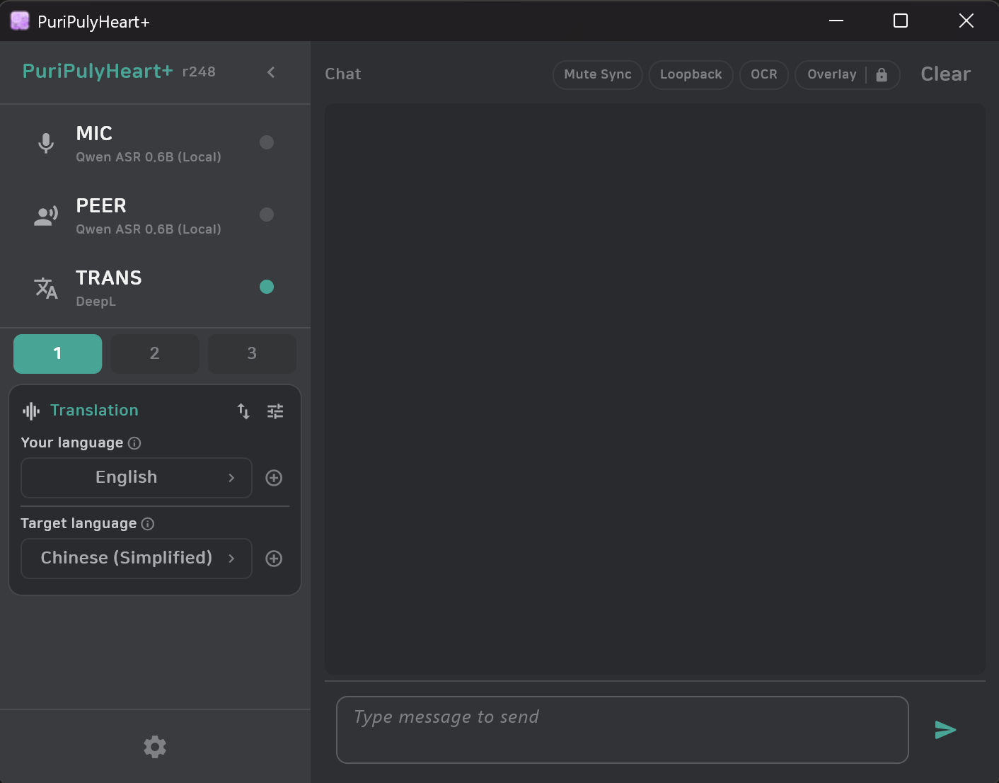

<p align="center">
  
</p>

<h1 align="center">PuriPulyHeart+</h1>

<p align="center">
  
  
  
  
</p>

<p align="center"><b>Two-way voice &amp; text translator for VRChat — free by default, updates itself, works behind firewalls.</b></p>

---



PuriPulyHeart+ listens to your voice, translates it, and prints it to the VRChat chatbox — and does the same in reverse for the person you're talking to, with subtitles on a desktop or VR overlay. Speech recognition runs **fully local** (Qwen ASR 0.6B) out of the box: no account, no API key, no credit card needed to start talking.

## Why this fork?

The original PuriPuly Heart already does the core job well: two-way voice translation (your voice and the other person's), a VR subtitle overlay, chatbox output, context-aware LLM translation, and a choice of cloud or local speech recognition. This fork keeps all of that — and changes who it's for: **no accounts, no payment, and no maintenance required.**

### New in this fork — not in the original

- **Realtime OCR translation** — the app can *read the game screen itself*. Press a key (ALT+E out of the box) and it detects text on screen — chat bubbles, nameplates, signs — recognizes it, and paints the translation right over the game as a live subtitle, with optional pinyin reading. It's built for VRChat: it knows what a chat bubble looks like, follows text as players move, ignores player names / pronoun tags / group banners (each filter is toggleable, with an "unfiltered" bind for quick peeks at world text), and can restrict itself to a screen region. Detection runs locally on your GPU; translation uses the free web engines by default. Right-click the **OCR** pill to configure everything.
- **Free translation built in** — Google and Bing web translation with no key, no cost, no account, plus **DeepL** support. The original expects a paid LLM provider; here you just install and start talking. If a paid translator can't run, translation automatically falls back to the free one instead of stopping.
- **One-click in-app updates** — when a new version is out, an update button appears in the sidebar; one click downloads, applies, and restarts the app. The original has no self-update.
- **A Windows installer** — `PuriPulyHeartPlus-Setup.exe`: per-user install (no admin prompt), Start-menu shortcut, uninstaller, installer UI in five languages, and it downloads the speech model during setup with an automatic China-friendly mirror.
- **Reading options for language learners** — an Output Format menu controlling exactly what goes to the chatbox (original + translation, translation only, reading only, and more), with **pinyin** (word-grouped or per-character) and **romaji** readings, configurable separately for chatbox and overlay.
- **Auto-launch with SteamVR or VRChat**, including a Steam launch-option wrapper.
- **Noise-resistant speech recognition** — garbled or repeating output from noisy audio is filtered out before it reaches the chat.

### Improved from the original

- **Overlay** — instant on/off and live switching between VR and desktop display, size presets, and position locking.
- **Peer translation** — the other person's speech is translated into *your* language automatically.
- **Works out of the box in restrictive regions** — sensible defaults for China (Bing translation, local speech model from a reachable mirror) and clear messages when a network is blocking something.
- **Polish everywhere** — three quick language preset slots, clearer status indicators with built-in VRChat OSC guidance, completed UI translations (English / 한국어 / 日本語 / 简体中文).

## Download

**[Get the latest release here](https://github.com/Sappha1/PuriPuly-heart-plus/releases/latest)**

- **`PuriPulyHeartPlus-Setup.exe`** — recommended. Installs per-user with shortcuts and fetches the speech model during setup.
- **`PuriPulyHeartPlus.zip`** — portable. Unzip anywhere and run `PuriPulyHeart.exe`.

Either way, that's the last download you do by hand — updates arrive through the in-app button afterwards.

## Quick start

1. Install (or unzip) and launch.
2. Pick your languages: **Your language** (what you speak and read) and **Target language** (the other person's language — your messages translate into it). The ⇅ button swaps them.
3. Click **MIC** to start voice recognition, **TRANS** for translation.
4. Enable OSC in VRChat: Action Menu → Options → OSC → **Enabled** (the Mute Sync chip turns green after you toggle your in-game mic once).
5. (Optional) **PEER** translates the other person's voice; **Overlay** shows subtitles on desktop or in VR.

### Using it in China

Works out of the box: local Qwen ASR for speech (the installer fetches it from a China-reachable mirror) and **Bing** as the translator (selected automatically on first run; Google is blocked there). Avoid Whisper — its model host (HuggingFace) is blocked, and the app will tell you so if you try.

### Bring your own keys (optional)

DeepL, Gemini, DeepSeek, Qwen, OpenRouter, Deepgram, and Soniox are supported in **Settings → API**. Keys verify automatically when entered and at every launch. Step-by-step signup guides with screenshots live in the collapsible sections of [docs/API_GUIDES.md](docs/API_GUIDES.md) if you need them.

### Antivirus warnings / "Error 5: Access denied"

The exes are open-source builds that aren't code-signed (yet), so brand-new releases can trigger Windows SmartScreen or antivirus false positives until they build up reputation — the same thing happens with upstream VRCT. If SmartScreen warns, use **More info → Run anyway**; if your antivirus quarantines a file, restore it and add the install folder as an exclusion.

If the installer fails with **"Unable to execute file in the temporary directory... Error 5: Access denied"**, or the OCR overlay won't start with the same error, check Windows 11 **Smart App Control**: Windows Security → App & browser control → Smart App Control settings (or run `Get-MpComputerStatus | Select SmartAppControlState` in PowerShell). Smart App Control blocks unsigned apps it doesn't recognize, **ignores antivirus exclusions**, and has no per-app whitelist — the only options are turning it off or using the zip download instead of the installer. Everything the app does is local and open source; you can audit and build it yourself from this repo.

## Development

| Area | Environment |
|---|---|
| Python app | Windows |
| VR overlay (Rust) | Windows |

```bash
python -m venv .venv
.venv\Scripts\activate
pip install -e '.[dev]'
python -m puripuly_heart.main run-gui
```

The VR subtitle overlay is built from `native/overlay/`:

```powershell
cargo build --manifest-path native/overlay/Cargo.toml --locked --release --bin PuriPulyHeartOverlay --target-dir target
Copy-Item target/release/PuriPulyHeartOverlay.exe build/overlay/PuriPulyHeartOverlay.exe -Force
Copy-Item third_party/openvr/win64/openvr_api.dll build/overlay/openvr_api.dll -Force
```

The installer is built from `installer.iss` with Inno Setup 6.

## Credits

- Fork developed by [Sappha1](https://github.com/Sappha1) together with **Claude** (Anthropic's AI coding agent).
- Based on **PuriPuly Heart** by [salee](https://github.com/kapitalismho) — thank you for the excellent foundation.
- Contributors and special thanks from the original project: RICHARDwuxiaofei; SUI_32C, Nagikokoro, motoka96, _Ykol魚, kascr_, Just Monika V, FLUVIA, Han โชเล่ย์, EA_PE, Ephedrine.

## License

[AGPL-3.0-or-later](LICENSE)

Third-party licenses and notices: `src/puripuly_heart/data/THIRD_PARTY_NOTICES.txt`
