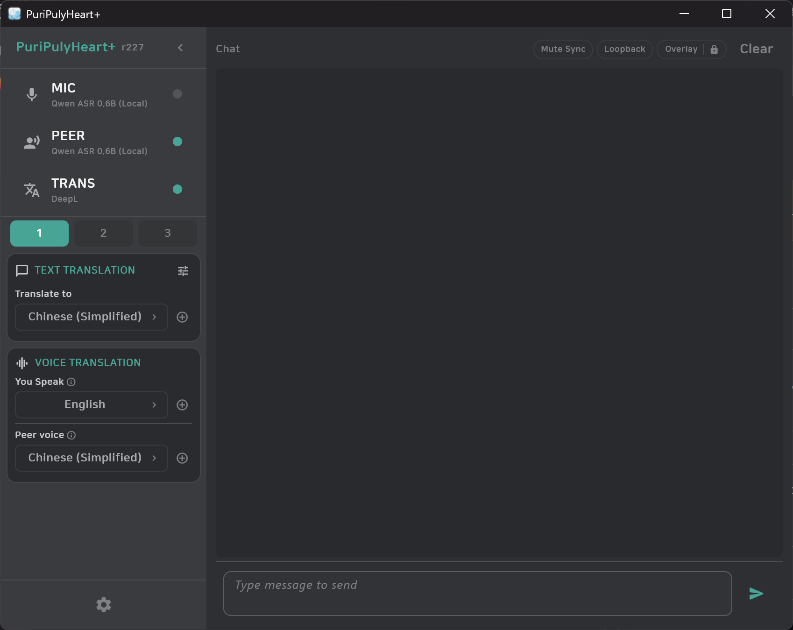

<p align="center">
  
</p>

<h1 align="center">PuriPulyHeart+</h1>

<p align="center">
  
  
  
  
</p>

<p align="center"><b>Two-way voice &amp; text translator for VRChat — free by default, updates itself, works behind firewalls.</b></p>

---



PuriPulyHeart+ listens to your voice, translates it, and prints it to the VRChat chatbox — and does the same in reverse for the person you're talking to, with subtitles on a desktop or VR overlay. Speech recognition runs **fully local** (Qwen ASR 0.6B) out of the box: no account, no API key, no credit card needed to start talking.

## Why this fork?

This is a heavily extended fork of PuriPuly Heart. It keeps the translation core and rebuilds the experience around being **free-first, self-maintaining, and reliable for real daily use**:

### Updates that take care of themselves
- **One-click in-app updates** — when a new version is out, an update button appears in the sidebar; one click downloads, applies, and restarts the app.
- **A real installer** — `PuriPulyHeartPlus-Setup.exe`: per-user install (no admin prompt), Start-menu shortcut, uninstaller, installer UI in English / 한국어 / 日本語 / 简体中文 / 繁體中文, and it downloads the speech model during setup with an automatic China-friendly mirror.

### Free by default
- **Google / Bing free web translation built in** — no key, no cost, no account. DeepL and LLM providers (Gemini, DeepSeek, Qwen, OpenRouter, local LLMs) supported when you bring your own key.
- **Automatic fallback** — if a paid translator can't run, translation switches to the free provider instead of stopping.

### Subtitle overlay
- **Instant on/off** and live switching between VR and desktop display.
- **Auto-launch with SteamVR or VRChat**, including a Steam launch-option wrapper.

### Reading options for language learners
- **Output Format menu** — choose exactly what goes to the chatbox: original + translation, translation only, reading only, and more.
- **Pinyin and romaji readings** — pinyin with word-grouping (jieba) or per-character, romaji per character, independently configurable for the chatbox and the overlay.

### Speech recognition you can trust
- **Local multilingual speech recognition** with automatic language detection — English, Chinese, Japanese, Korean and more without switching models.
- **Noise-resistant** — garbled or repeating output from noisy audio is filtered out before it reaches the chat.
- **The other person's speech is translated into *your* language**, following your "You Speak" setting.

### Quality of life
- Three quick language preset slots, favorites for saved configurations, built-in guidance for VRChat OSC setup, and UI in English / 한국어 / 日本語 / 简体中文.

## Download

**[Get the latest release here](https://github.com/Sappha1/PuriPuly-heart-plus/releases/latest)**

- **`PuriPulyHeartPlus-Setup.exe`** — recommended. Installs per-user with shortcuts and fetches the speech model during setup.
- **`PuriPulyHeartPlus.zip`** — portable. Unzip anywhere and run `PuriPulyHeart.exe`.

Either way, that's the last download you do by hand — updates arrive through the in-app button afterwards.

## Quick start

1. Install (or unzip) and launch.
2. Pick your languages: **Translate to** (what your chatbox prints), **You Speak**, and **Peer voice**.
3. Click **MIC** to start voice recognition, **TRANS** for translation.
4. Enable OSC in VRChat: Action Menu → Options → OSC → **Enabled** (the Mute Sync chip turns green after you toggle your in-game mic once).
5. (Optional) **PEER** translates the other person's voice; **Overlay** shows subtitles on desktop or in VR.

### Using it in China

Works out of the box: local Qwen ASR for speech (the installer fetches it from a China-reachable mirror) and **Bing** as the translator (selected automatically on first run; Google is blocked there). Avoid Whisper — its model host (HuggingFace) is blocked, and the app will tell you so if you try.

### Bring your own keys (optional)

DeepL, Gemini, DeepSeek, Qwen, OpenRouter, Deepgram, and Soniox are supported in **Settings → API**. Keys verify automatically when entered and at every launch. Step-by-step signup guides with screenshots live in the collapsible sections of [docs/API_GUIDES.md](docs/API_GUIDES.md) if you need them.

## Development

| Area | Environment |
|---|---|
| Python app | Windows |
| VR overlay (Rust) | Windows |

```bash
python -m venv .venv
.venv\Scripts\activate
pip install -e '.[dev]'
python -m puripuly_heart.main run-gui
```

The VR subtitle overlay is built from `native/overlay/`:

```powershell
cargo build --manifest-path native/overlay/Cargo.toml --locked --release --bin PuriPulyHeartOverlay --target-dir target
Copy-Item target/release/PuriPulyHeartOverlay.exe build/overlay/PuriPulyHeartOverlay.exe -Force
Copy-Item third_party/openvr/win64/openvr_api.dll build/overlay/openvr_api.dll -Force
```

The installer is built from `installer.iss` with Inno Setup 6.

## Credits

- Fork developed by [Sappha1](https://github.com/Sappha1) together with **Claude** (Anthropic's AI coding agent), who wrote much of the fork's code and pushes every release.
- Based on **PuriPuly Heart** by [salee](https://github.com/kapitalismho) — thank you for the excellent foundation.
- Contributors and special thanks from the original project: RICHARDwuxiaofei; SUI_32C, Nagikokoro, motoka96, _Ykol魚, kascr_, Just Monika V, FLUVIA, Han โชเล่ย์, EA_PE, Ephedrine.

## License

[AGPL-3.0-or-later](LICENSE)

Third-party licenses and notices: `src/puripuly_heart/data/THIRD_PARTY_NOTICES.txt`
