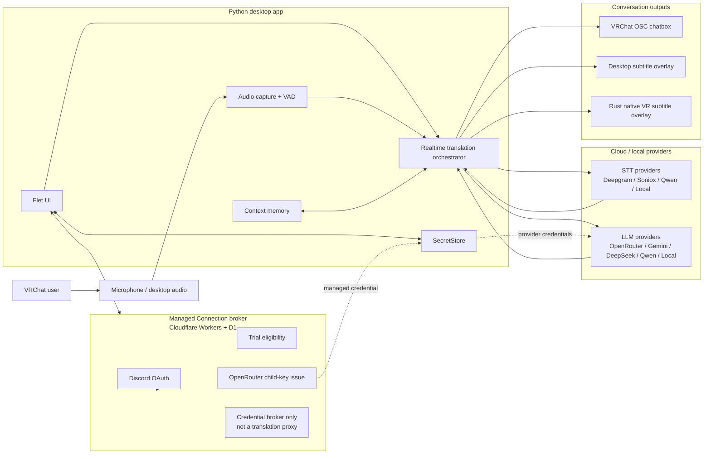

```mermaid
flowchart LR
  User[VRChat user]
  Mic[Microphone / desktop audio]

  subgraph App[Python desktop app]
    UI[Flet UI]
    Audio[Audio capture + VAD]
    Orchestrator[Realtime translation orchestrator]
    Memory[Context memory]
    Secrets[SecretStore]
  end

  subgraph Providers[Cloud / local providers]
    STT[STT providers\nDeepgram / Soniox / Qwen / Local]
    LLM[LLM providers\nOpenRouter / Gemini / DeepSeek / Qwen / Local]
  end

  subgraph Outputs[Conversation outputs]
    Chatbox[VRChat OSC chatbox]
    DesktopOverlay[Desktop subtitle overlay]
    VROverlay[Rust native VR subtitle overlay]
  end

  subgraph Broker[Managed Connection broker\nCloudflare Workers + D1]
    Discord[Discord OAuth]
    Eligibility[Trial eligibility]
    ChildKey[OpenRouter child-key issue]
    NotProxy[Credential broker only\nnot a translation proxy]
  end

  User --> Mic
  Mic --> Audio
  UI --> Orchestrator
  Audio --> Orchestrator
  Memory <--> Orchestrator

  Orchestrator --> STT
  STT --> Orchestrator
  Orchestrator --> LLM
  LLM --> Orchestrator

  Orchestrator --> Chatbox
  Orchestrator --> DesktopOverlay
  Orchestrator --> VROverlay

  UI <--> Secrets
  UI <--> Broker
  Broker --> Discord
  Broker --> Eligibility
  Broker --> ChildKey
  Broker --> NotProxy
  ChildKey -. managed credential .-> Secrets
  Secrets -. provider credentials .-> LLM
```
